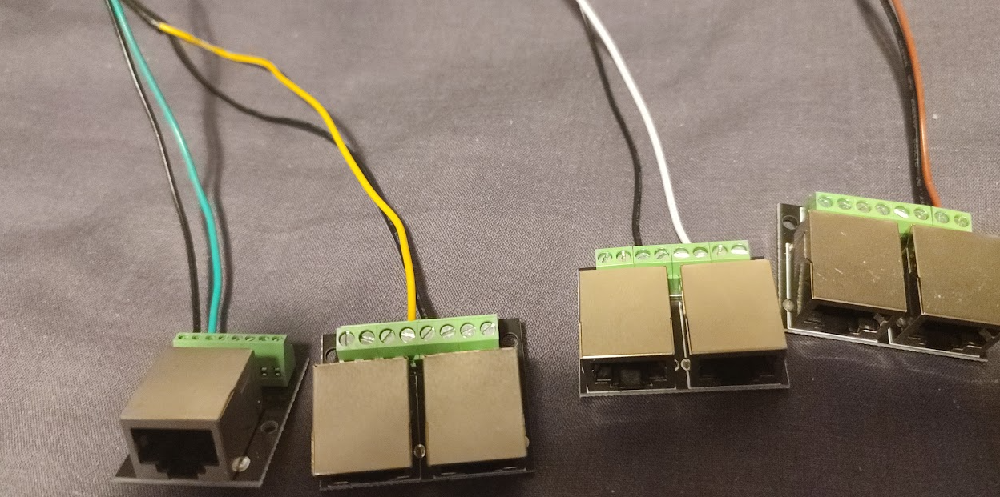

# MK-SmartBed

WRITEUP IS A WORK IN PROGRESS

This Project was mostly a learning exercise for myself to learn about creating a custom sensor control using an esp32.

I decided write this up in case this helps or inspires someone else to do the same or a simalar project.

## Project Goal

Use multiple Sensors to detect presence in a bed

Add a tempreture sensor to the bed

Have this report into home Assistant

OR this sensor with a prexisting mmWave Sensor to help ensure accurate room presence detection

## The Plan

get an ESP32 dev board and install with espHome

Create PCB on stripboard to house esp32 and other components

get and attach 4 FSR sensors and a tempreture probe

put PCB into a "box" with an easy way to connect it to the sensors and power

Program the ESP32 to do what I want

## The FSR Sensors


So I decided to go with 4 sensors to ensure accurate sensor detection (this would not be necessary but we will get to that later)

2 at "shoulder level" starting at ethier side of the bed

2 at "butt level" starting at ethier side of the bed


Wiring these around the bed felt like it might become an issue so I opted to use a cat6 network cable to connect the sensors as this gave me 4 pairs of cables nicely bundled together.

Could I have shared the grounds for the sensors on the cat6? almost certainly yes but I figured keeping them seperate gave me the best troubleshooting options if something went wrong.

I investigated and found small rj45 breakout boards with screw terminals which would allow for me to easilly break into the signals along the way. these came in 2 flavours. 1 port for the ends of the chain and 2 connected ports for the middle parts of the chain.




Sensor 1 - 1 Port - breaking out the cat6 orange pair of the cat6

Sensor 2 - 2 Port - breaking out the cat6 blue pair of the cat6

Sensor 3 - 2 Port - breaking out the cat6 green pair of the cat6

Sensor 4 - 2 Port - breaking out the cat6 brown pair of the cat6

Controller - 1 port - connecting the pairs to the pcb of the cat6

My plan was to measure the resistance of each sensor with the bed empty and again when "occupied" to calculate the best pull up resistor value to use. however this proved unsucsessful as measuring the resistance over this distance was unreliable with my (admittedly cheap) multimeter. My next plan was to build a quick voltage devider resistance sensor circuit using the esp32 on breadboard but this also proved unreliable. So i opted for trial and error going through my resistor box until I saw it working. after a few attempts I settled on 5.6k which although maybe didnt give me the best range it was definetly accurate enough to detect yes/no in software.


these would then be attached along the slats of the bed with the rj45 ports underneath the slat (I opted to use electical tape for this)

## The Tempreture Probe 

This was just a DS18B20 with a long cable taped in position behind the headboard of the bed

this cable along with the cat6 from the FSR sensors would then be attached to the Controller

## The Controller PCB

on the stripboard I then attached 2 dip headers to put my prepinned esp32 dev board onto and attached a number of short cables to attach to my sensors. along with 5 resistors:

4 x 5.6k resistors as pull up resistors on the FSR sensors

1 x 4.7k resistor as pull up resistor on the tempreture sensor data line

not the most complicated circuit in the word but it was fairly easy for someone who hasnt touched a soldering iron in years


## The controller Box

A cheap project box with some holes drilled for the cables to come out and a short USB-C extention for power was the layout I went with.

one of the RJ45 breakout boards mounted with cable ties through its mounting holes and just some wagos cable tie based down was my basic connection handlers

I should probably label the rj45 "NOT Ethernet" at some point but in its current form it seems obvious that its probably not a good idea to plug it into a switch...


## The ESPHome Code

I was plesently supprised how easy this was to write and soon had it running as intended and used the following sensors:

Tempreture - using the dallas tempreture sensor component

Bed Trigger Level - adjustable number that would let me move adjust the sensitivity as required

Bed_sensor_1/2/3/4 - For reading the voltage on the pin through the SR sensors

Bed Sensor 1/2/3/4 occupied - binary sensor showing showing if sensor voltage is above/below the trigger level

Top of Bed Occupied - binary sensor that is an OR of sensors 1 and 2 being occupied

Middle of Bed occupied - binary sensor that is an OR of sensors 3 and 4 being occupied

Bed Occupied - Binary sensor that is an OR of all 4 sensors which has a delayed on of 5 seconds and a delayed off of 30 seconds


In normal operation I expect to use only the "Bed Occupied" and the "Tempreture" sensors and there is definetly more efficient ways to write this setup however this was straight forward and left me room for fault finding/ debbugging if/when needed

Full (badly written) code available [HERE](esphome-web-f34bb0.yaml)

## Home Assistant integration

Thanks to writing and programming esphome from within HA, this was basically automagically done for me and all i had left to do was to OR it with my mmWave sensor on my everything presence one which was achieved with this template:

````
{{ is_state('binary_sensor.everything_presence_one_6db848_occupancy', 'on') 
            or
            is_state('binary_sensor.esphome_web_f34bb0_bed_occupied', 'on') 
            }}
````

this then provided me a combined room presence sensor

## Conclusion

This was a great project that let me learn the basics of esp32 circuit construction and esphome and gave me confidence with using them in future projects to make "dumb" devices "smart" which might be more complicated projects so it is nice to learn the basics in a nice easy project.

Using cat6 cables keeps it pretty neat and them being standard network cabels means that they are easily interchangleable if things get mixed up during a move etc...

The output is very reliable and I would have no issue using it in automationss

## What should i have done differntly?

4 sensors is overkill for this size of bed... I would probably be fine but would probably go for 2 (1 at top and 1 at middle of bed)

During an extended "test session" of the sensors lasting just under 9.5 hours the only 1 of the sensors went into a "false negitive" state which was for only 2 seconds. so any of the sensors with a delayed off would have been reliable for the entire test session. and as such the main combined sensor with the delayed off was reliable.


A smaller box to house the controller in... it is a bit big but its only under the bed so its not a major issue.

## will there be a v2 and what will change?

I am pretty happy with how the FSR sensors are set up (although there are too many of them) however the controler would be reworked

I would look to me make a custom PCB which houses all the components in a smaller footprint with a RJ45 port directly on it for the FSR sensors and also probably a 3.5mm jack which would be a better way to attach the tempreture sensor.

I Probably would add a 2nd 3.5mm jack for a 2nd tempreture sensor to expand its connectivity

Or I could share the grounds and integrate the tempreture probe into the cat6 chain

There is also a chance i think of something else between now and a v2 becoming a reality that I think would be good to use to make the bed "smarter"

This would them probably be housed inside a custom box probably 3d printed

Something smaller would be easy to mount directly to the bed frame to keep it out the way
